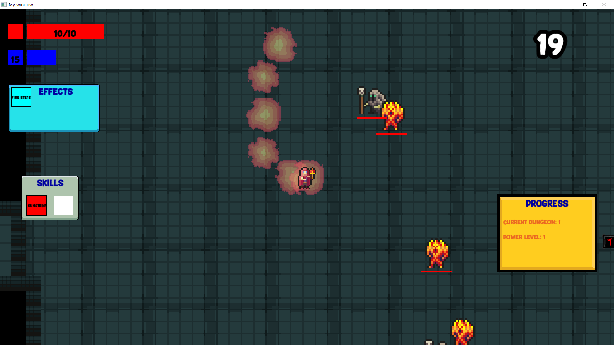
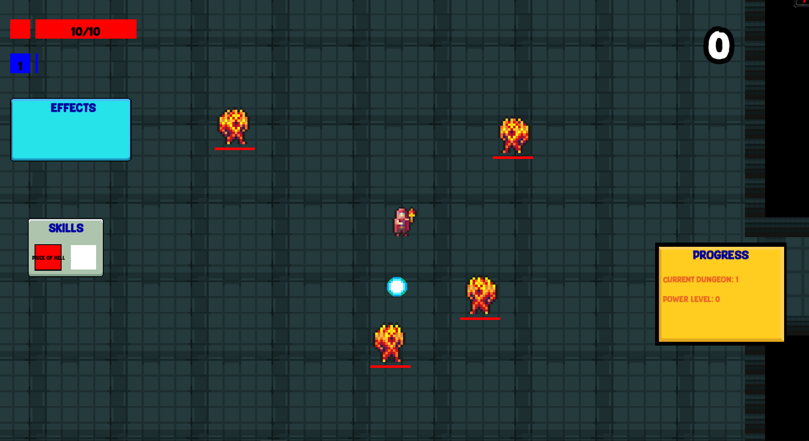
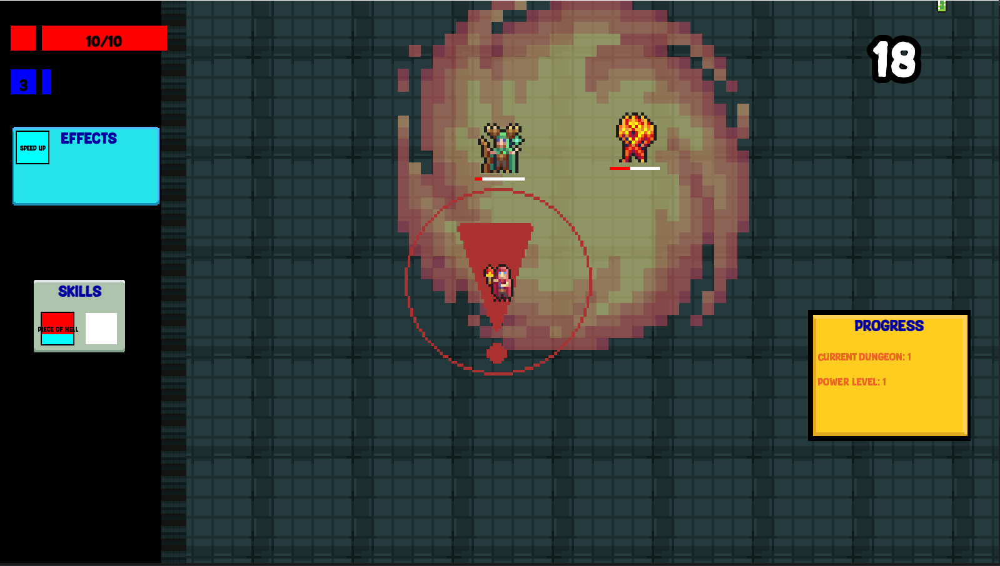
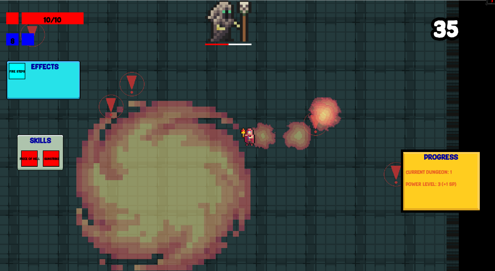
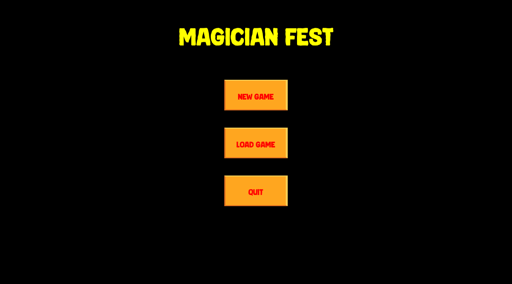
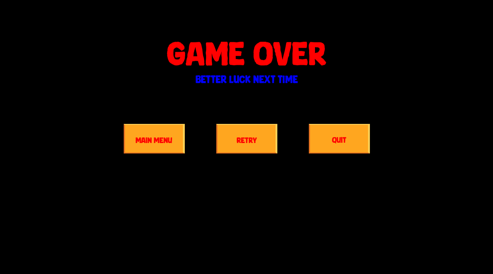

<b>Introduction</b>

Welcome to Magician Fest, a thrilling rogue-like dungeon crawler where you take on the role of a powerful magician. Choose between two unique magic staffs, each offering different skills, and battle through increasingly challenging rooms filled with enemies. The deeper you delve, the tougher the opponents, with epic boss battles waiting at the end of each level. The game is endless, providing a relentless challenge as you strive to achieve the highest score.

<b>Features</b>

- Two Magic Staffs: Select from two unique staffs, each with its own skill set.
- Endless Gameplay: Continue fighting as long as you can survive, with enemies growing stronger over time.
- Leveling System: Gain experience and unlock new skills as you defeat enemies.
- Challenging Boss Battles: Face off against powerful bosses at the end of each level.
- High Score Tracking: Compete against yourself and others to achieve the highest score.

<b>How to Run the Game</b>

Prerequisites:
- CMake: Ensure that CMake is installed on your system.
- C++ Compiler: A C++ compiler compatible with CMake (e.g., GCC, Clang, or MSVC).

<b>Compilation and Execution</b>

1. Clone the Repository
2. Generate Build Files with CMake
3. Compile the Game
4. Run the main.cpp file

<b>Controls</b>

- Movement: WASD
- Attack: Left mouse click
- Pause: Esc
- Acquire new skill: N

Gallery:

Gameplay video without graphics:
https://github.com/user-attachments/assets/c9de41f4-271f-4ba6-8b8e-82798d320ef4

Gameplay video with graphics:
https://github.com/user-attachments/assets/6988faa3-aafe-4829-b757-7f81fa1d7281

